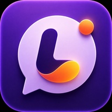

  
  <h1>LingoDe</h1>
  
An AI-powered German learning app for C1/TestDaF/DSH exam preparation.

  
<strong>Live:</strong> <a href="https://lingode.netlify.app">lingode.netlify.app</a>

> **PWA:** Add to Home Screen on iOS (Safari → Share → Add to Home Screen) or Android (Chrome → Add to Home Screen) for a full native app experience.

---

## What makes it different

LingoDe is built around the real German exam formats — Goethe C1, TestDaF, and DSH. Every feature targets a specific skill tested in these exams, and most of them are powered by Claude AI to generate unique content and give detailed feedback on every attempt.

---

## Features

### Vocabulary
- Add words by photographing a page or uploading a file — AI extracts and structures the vocabulary automatically
- Spaced repetition with the SM-2 algorithm: words surface exactly when you're about to forget them
- Flashcard review and word matching games

### Writing
- **Schreibtrainer** — Goethe C1 format (Brief or Essay), AI scores by Grammatik, Wortschatz, Kohärenz and Register with detailed corrections
- **Hochschulschreibtrainer** — TestDaF and DSH academic writing with exam-specific scoring
- **Tages-Schreiben** — Short daily writing practice (argumentation or summary), 15-minute timer

### Speaking
- **Mündlich Trainer** — Practice oral presentations on C1 topics with impulse cards, AI evaluates structure and content

### Reading
- **Leseverstehen** — AI-generated reading texts in Goethe, telc, TestDaF and DSH formats with multiple choice, Richtig/Falsch/Nicht im Text and gap-fill questions

### Grammar
- Interactive lessons across A1–C2 with exercises
- Dedicated trainers: Konjunktiv II, Passiv, Präpositionalverben, Nomen-Verb-Verbindungen, Kollokationen, Sprachbausteine, Satzstellung

### Profile & Stats
- 30-day activity heatmap
- Vocabulary mastery breakdown (New / Learning / Mastered)
- Exercise score history and averages by type

---

## Tech Stack

| Layer | Technology |
|---|---|
| Frontend | Angular 17 (standalone components, signals), Tailwind CSS, PWA |
| Backend | Node.js, Express |
| Database | MongoDB Atlas |
| Auth | Firebase Google Auth |
| AI | Anthropic Claude API |
| Deployment | Netlify (frontend), Render (backend) |

---

## AI Integration

Powered by the Anthropic Claude API throughout:

- **Word extraction** — Reads OCR text from photos and returns structured vocabulary entries
- **Writing feedback** — Category-by-category scoring with inline corrections and improvement suggestions
- **Writing prompts** — Generates a unique task every session so you never repeat the same exercise
- **Leseverstehen** — Creates full reading comprehension exercises with texts and questions on demand
- **Mündlich feedback** — Analyses spoken-language presentation for structure, vocabulary and fluency
